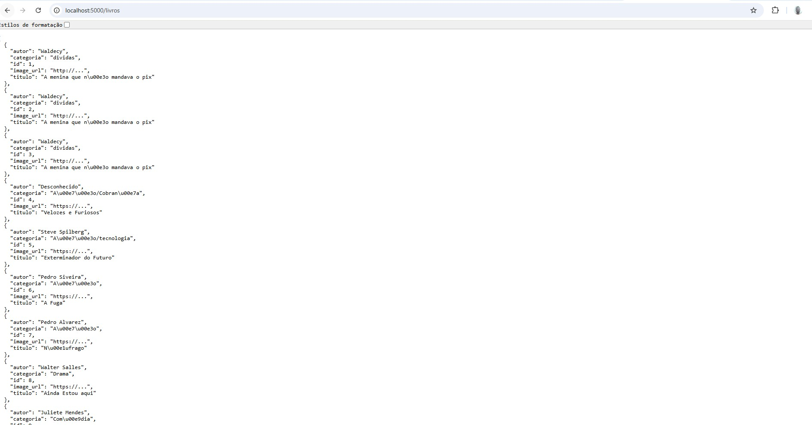
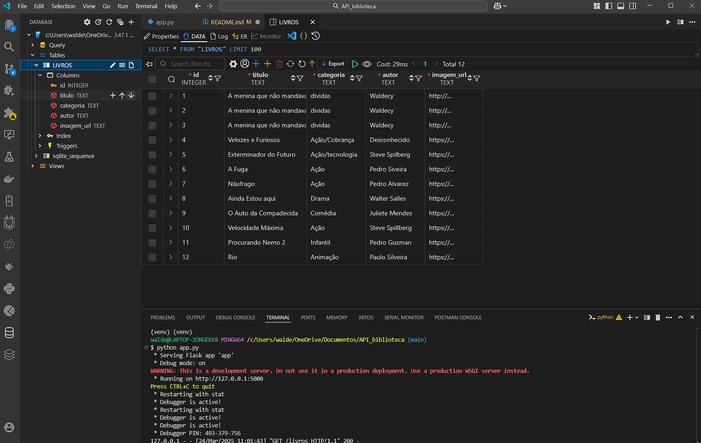
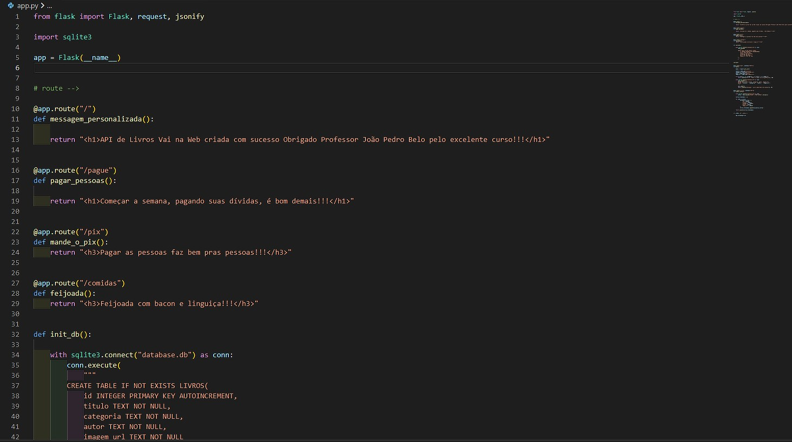

#Api de Doação de Livros

Essa é uma API simples feita com Flask e Sqlite3 para fins de estudo da escola Vai na WEb, ela permite cadastrar e listar doados.

## Como codar o projeto

1. Faça o clone do repositório:
```bash
git clone <https://github.com/waldecyfa/API_biblioteca.git>
cd nome-do-projeto
```

2. Crie um ambiente virtual (obrigatório):
´´´bash
python -m venv venv
source venv/Scripts/activate    

3, Instale as dependências  
´´´bash
pip install -r requirements.txt   
´´´
4. Inicie o servidor:
´´´bash
python app.py
´´´

> A api está disponível em http: https://api-biblioteca-duyo.onrender.com/livros

## Endpoints

### POST /doar

Endpoint para cadastrar um novo livro

**Formato de envio dos dados**
´´´json

{
    "titulo":"50 Tons de dívida",
    "categoria":"Finanças",
    "autor":"Fernando Polia",
    "image_url":"https://exemplo.com"
}
´´´; 

**Resposta 201 (Created)**:
´´´json
{
    "mensagem": "Livro cadastrado com sucesso"
}








